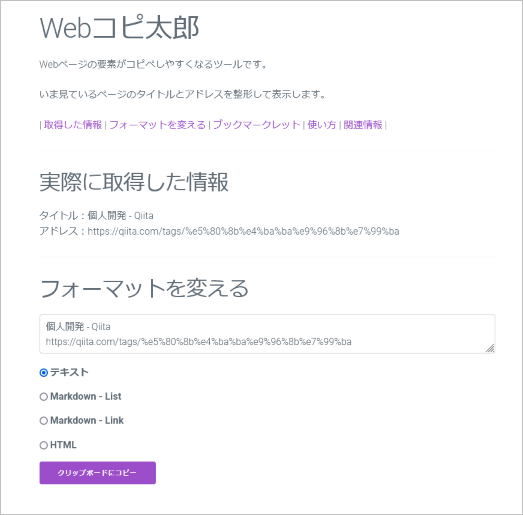

# Web copy-taro

Copy and paste elements in web page.

Webコピ太郎は、Webページの要素をコピペするツールです。

いま見ているページのタイトルとアドレスを整形して表示します。

https://www.catch.jp/program/copy-taro/

## License

Web copy-taro is released under the MIT License.
